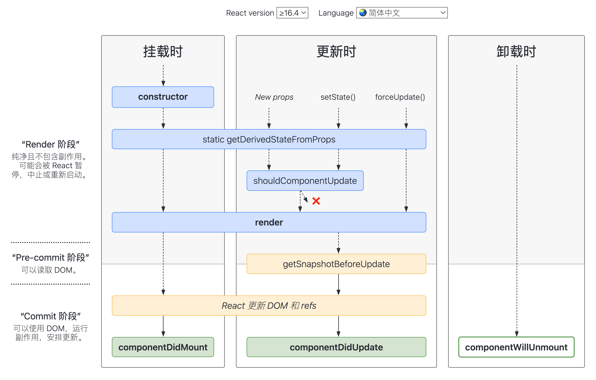

# React 常见面试题

::: info 相关资料

- [React 官方文档](https://zh-hans.reactjs.org/)
- [旧版 React 官方文档](https://zh-hans.legacy.reactjs.org)
- [深入浅出搞定 React | 拉钩教育](https://kaiwu.lagou.com/course/courseInfo.htm?courseId=510)
- [前端面试宝典之 React 篇 | 拉钩教育](https://kaiwu.lagou.com/course/courseInfo.htm?courseId=566)

:::

## `JSX` 语法

`JSX` 是一个 `JavaScript` 的语法扩展，结构类似 `XML`

### 为什么要使用 `JSX`

> `JSX` 是 `React` 的一大特性

使用 `JSX` 可以让我们在 `JavaScript` 中编写类似 `HTML` 的代码，这样做的好处是可以让我们在 `JavaScript` 中直接使用 `HTML` 标签，而不用通过 `document.createElement` 等方法来创建元素，这样可以让我们的代码更加简洁，更加直观

### JSX 语法的本质

在 `React` 中所有的元素都是通过 `React.createElement` 方法创建的。使用 `JSX` 语法的代码最终会被 `Babel` 编译为 `React.createElement` 方法，即 **`JSX` 语法的本质就是 `React.createElement` 方法**

```jsx
// JSX 语法
import React from 'react'
const element = <h1 className="greeting">Hello, world!</h1>

// 通过 babel 转化为 React.createElement 方法
import React from 'react'
const element = React.createElement('h1', { className: 'greeting' }, 'Hello, world!')
```

这也是为什么在 `React 17` 之前我们在使用 `JSX` 语法时必须要引入 `React` 的原因，如果不引入 `React` 就会因为找不到 `React.createElement` 方法导致编译失败

::: tip 全新的 JSX 转换
`React 17` 提供了[全新的 JSX 转换](https://zh-hans.legacy.reactjs.org/blog/2020/09/22/introducing-the-new-jsx-transform.html)，在使用时不再需要引入 `React`

```jsx
// 源代码
function App() {
  return <h1>Hello World</h1>
}

// 新的 JSX 转换
import { jsx as _jsx } from 'react/jsx-runtime'

function App() {
  return _jsx('h1', { children: 'Hello world' })
}
```

:::

### `JSX` 和 `HTML` 的区别

`JSX` 和 `HTML` 有以下几点区别：

- `JSX` 中的标签名使用驼峰命名法，而 `HTML` 中的标签名使用小写字母命名法；
- `JSX` 中的标签属性名使用驼峰命名法，而 `HTML` 中的标签属性名使用小写字母命名法；
- `JSX` 中的标签属性值可以是字符串也可以是表达式，而 `HTML` 中的标签属性值只能是字符串；
- `JSX` 中的标签可以自定义，而 `HTML` 中的标签必须是 `HTML` 规定的标签。

### 为什么使用自定义组件必须以大写字母开头

在 `JSX` 中，如果标签名以小写字母开头，那么它会被当作一个字符串而不是一个组件来处理，而如果标签名以大写字母开头，那么它会被当作一个组件来处理。这是因为在 `JSX` 中，`React` 会将以小写字母开头的标签名视为 `HTML` 原生标签，而将以大写字母开头的标签名视为自定义组件。为了避免混淆，`React` 自定义组件的标签名必须以大写字母开头

```jsx
/* 使用原生标签 */
<app>maomao</app>
// 等价于
React.createElement('app', null, 'maomao')

/* 使用自定义组件 */
<App>maomao</App>
// 等价于
React.createElement(App, null, 'maomao')
```

## 数据在 `React` 组件中的流动

`React` 是数据驱动视图，即视图会随着数据的变化而变化

### 单向数据流

**`React` 是基于 `props` 的单向数据流**，指**当前组件的 `state` 以 `props` 的形式流动时，只能流向组件树中比自己层级更低的组件**，即流动是单向的，只能从父组件流向子组件，而不能从子组件流向父组件

### `state` 和 `props` 的区别

> `state` 和 `props` 都是组件的数据来源，但它们有以下区别：

- `state` 是可变的，是组件内部维护的一组用于反映组件 UI 变化的状态集合
- `props` 是组件的只读属性，组件内部不能直接修改，只能通过外部传入新的 `props` 来更新组件

即：**`state` 是组件对内的接口，`props` 是组件对外的接口**

### 组件通信

在 `React` 中，组件之间的通信主要有以下几种：

- 父组件向子组件通信
- 子组件向父组件通信
- 兄弟组件通信
- 父组件向后代组件通信
- 无关组件通信

#### 父组件向子组件通信

利用 `React` 单向数据流通过 `props` 进行传递通信

```jsx
// 子组件
function Child(props) {
  return <div>{props.name}</div>
}

// 父组件
function Parent() {
  return <Child name="maomao" />
}
```

#### 子组件向父组件通信

通过 `props` 传递回调函数进行通信

> 子组件通过调用父组件传递过来的回调函数来向父组件通信

```jsx
// 子组件
function Child(props) {
  return <button onClick={() => props.onClick('我是子组件的数据')}>传递数据给父组件</button>
}

// 父组件
function Parent() {
  const handleClick = (data) => {
    console.log(data) // 点击后会输出：我是子组件的数据
  }

  return <Child onClick={handleClick} />
}
```

#### 兄弟组件通信

通过父组件中转数据的方式进行通信，即**兄弟组件之间的通信需要将数据提升到它们的共同父组件中进行管理**

`兄弟 1 → 兄弟 2` 会变成 `兄弟 1 → 父组件`（子父通信）和 `父组件 → 兄弟 2`（父子通信）

```jsx
// 兄弟组件
function Brother1(props) {
  return <div>{props.name}</div>
}

function Brother2(props) {
  return <button onClick={() => props.onClick('茂茂')}>传递数据给兄弟组件</button>
}

// 父组件
function Parent() {
  const [name, setName] = useState('maomao')

  const handleClick = (data) => {
    setName(data)
  }

  return (
    <>
      <Brother1 name={name} />
      <Brother2 onClick={handleClick} />
    </>
  )
}
```

#### 父组件向后代组件通信和无关组件通信

> 父组件向后代组件通信不使用 `props` 传递数据，当层层传递 props 时会造成组件之间的耦合，不利于组件的复用，而且会造成组件之间的数据流动不可控

常见的解决方案有以下几种：

- 使用 `React` 的 `Context` 进行通信
- 使用发布订阅模式进行通信
  - [event-emitter](https://github.com/medikoo/event-emitter)
  - [mitt](https://github.com/developit/mitt)
  - [eventbus](
- 使用第三方状态管理库进行通信
  - [Zustand](https://docs.pmnd.rs/zustand/getting-started/introduction)
  - [Redux](https://cn.redux.js.org)
  - [Mobx](https://zh.mobx.js.org)

**使用 `React` 的 `Context` 进行通信**

```jsx
// 创建 Context
const Context = React.createContext()

// 子组件
function Child() {
  const { name } = useContext(Context)

  return <div>{name}</div>
}

// 父组件
function Parent() {
  return (
    <Context.Provider value={{ name: 'maomao' }}>
      <Child />
    </Context.Provider>
  )
}
```

::: info `Context` 相关资料
[使用 Context 深层传递参数 | React](https://zh-hans.react.dev/learn/passing-data-deeply-with-context)
:::

## 组件的生命周期

> 只有类组件才有生命周期，函数组件没有生命周期

::: tip `getDerivedStateFromProps` 方法

- 用于 `props` 到 `state` 的映射
- 设计成静态方法的是为了阻止开发者在其内部使用 `this`，从而防止错误的使用 `this.setState`

:::

### React 16.3 的生命周期


在 `React 16.3` 版本时只有父组件的更新会触发 `static getDerivedStateFromProps`

### React 16.4 之后的生命周期



- 挂载阶段
  - `constructor`：初始化 `state` 和 `props`
  - `static getDerivedStateFromProps`：根据 `props` 初始化 `state`
  - `render`：渲染组件
  - `componentDidMount`：组件挂载完成
- 更新阶段
  - `static getDerivedStateFromProps`：根据 `props` 更新 `state`
  - `shouldComponentUpdate`：控制组件是否更新
  - `render`：渲染组件
  - `getSnapshotBeforeUpdate`：在组件更新前获取 DOM 信息
  - `componentDidUpdate`：组件更新完成
- 卸载阶段
  - `componentWillUnmount`：组件卸载前

在 React 16.4 之后，任何因素触发的组件更新流程（包括 `this.setState` 和 `forceUpdate` 触发的更新流程）都会触发 `static getDerivedStateFromProps`

---

::: info 相关资料

- [你可能不需要使用派生 state](https://zh-hans.legacy.reactjs.org/blog/2018/06/07/you-probably-dont-need-derived-state.html)
- [React lifecycle methods diagram](https://projects.wojtekmaj.pl/react-lifecycle-methods-diagram/)

:::

## 受控组件与非受控组件

`React` 的受控组件与非受控组件的概念是针对表单元素而言的，由于获取表单元素内部 `state` 的实现方式的不同，就产生了受控组件和非受控组件

### 受控组件

受控组件是由 `React` 控制表单数据，即**表单数据由 `React` 组件的 `state` 管理**

```jsx
// 组件内部管理表单的值
function App() {
  const [value, setValue] = useState('')

  return <input value={value} onChange={(e) => setValue(e.target.value)} />
}

// 父组件管理表单的值
function App({ value, onChange }) {
  return <input value={value} onChange={(e) => onChange(e.target.value)} />
}
```

### 非受控组件

**非受控组件是指表单数据将交由 `DOM` 节点来处理**

```jsx
function App() {
  const inputRef = useRef(null)

  return (
    <>
      <input ref={inputRef} />
      <button onClick={() => console.log(inputRef.current.value)}>获取表单的值</button>
    </>
  )
}
```

---

::: info 相关资料

- [受控组件 | React](https://zh-hans.legacy.reactjs.org/docs/forms.html)
- [非受控组件 | React](https://zh-hans.legacy.reactjs.org/docs/uncontrolled-components.html)
- [React 组件的受控与非受控](https://zhuanlan.zhihu.com/p/536322574)

:::

## 类组件与函数组件的区别

类组件与函数组件都是 `React` 组件的展现形式，其区别主要有以下几点：

- 类组件是 `OOP（面向对象编程）`，函数组件是 `FP（函数式编程）`
- 类组件可以使用 `this` 来访问组件实例，函数组件没有实例只能通过函数的参数和闭包来访问组件状态和方法
- 类组件使用 `PureComponent` 或 `shouldComponentUpdate` 来控制组件是否更新；函数组件依靠 `React.memo`、`useMemo`、`useCallback`、`useRef` 缓存来提升性能
  - `PureComponent` 由 `React` 内部控制组件是否更新
  - `shouldComponentUpdate` 由开发者控制组件是否更新
  - `React.memo` 用于缓存组件渲染结果
  - `useMemo` 用于缓存值
  - `useCallback` 用于缓存函数
- 类组件通过生命周期包装业务逻辑，函数组件通过 `Hooks` 来实现相应的功能
- 类组件可以使用 `ref` 来获取组件实例，函数组件需要使用 `useRef` 来获取组件实例

::: tip
总的来说，函数组件更加简洁、易于维护和测试，而类组件容易造成代码冗余、逻辑难以复用（业务逻辑散落在生命周期中）；<br />
同时随着 `React Hooks` 的推出，生命周期概念的淡出，函数组件可以完全取代类组件；<br />
其次继承并不是组件最佳的设计模式，官方更推崇“组合优于继承”的设计概念，所以类组件在这方面的优势也在淡出；<br />
类组件在未来时间切片与并发模式中，由于生命周期带来的复杂度，并不易于优化。而函数组件本身轻量简单，且在 `Hooks` 的基础上提供了比原先更细粒度的逻辑组织与复用，更能适应 `React` 的未来发展。
:::

## 什么是高阶组件 (HOC)

> 高阶组件即 higher-order component (HOC)

高阶组件是灵活使用 `React` 组件的一种技巧，其本身不是组件，而是**一个参数为组件返回值也是一个组件的函数**

**高阶组件的作用**：

- 代码复用、逻辑复用：页面复用
- 条件渲染：控制组件的渲染逻辑（权限控制）
- 生命周期捕获/劫持：借助父组件子组件生命周期规则捕获子组件的生命周期（组件渲染性能追踪、日志打点）

**实现高阶组件的方式及其功能**：

- 属性代理
  - 操作 `props`（增加、删除、修改）
  - 提取 `state`
  - 条件渲染
  - 用其他元素包裹 `WrappedComponent`（样式修改）
- 反向继承
  - 劫持生命周期
  - 渲染劫持
    - 条件渲染
    - 操作由 `render()` 输出的 `React` 元素树
    - 用其他元素包裹 `WrappedComponent`（样式修改）
  - 操作 `WrappedComponent` 组件的 `state`

### 属性代理

> 一般来说业务组件表示被代理的组件，高阶组件表示代理组件

属性代理是用高阶组件包裹一层业务组件，通过高阶组件对业务组件进行代理操作，其生命周期关系完全是 `React` 父子组件的生命周期关系（即通过父组件对子组件进行一系列强化操作）

```jsx
/* 使用函数组件实现高阶组件 */
function HOC(WrappedComponent) {
  return function H(props) {
    const [state] = useState({ name :'hoc' })

    return <WrappedComponent {...props} {...state} />
  }
}

/* 使用类组件实现高阶组件 */
function HOC(WrappedComponent) {
  return class H extends React.Component {
    state = { name: 'hoc' }
    render() {
      return <WrappedComponent {...this.props} {this.state} />
    }
  }
}
```

### 反向继承

反向继承是指高阶组件通过继承业务组件的方式来操作业务组件的 `state`、`props`、组件生命周期方法和 `render` 方法

```jsx{2-3}
function HOC(WrappedComponent) {
  // 继承业务组件，而不是 React.Component
  return class H extends WrappedComponent {
    render() {
      return super.render()
    }
  }
}
```

### 属性代理和反向继承的总结

- 属性代理是从组合的角度来实现，即从外部去操作 `WrappedComponent`
  - **优点**
    - 适用于函数组件和类组件（对于**条件渲染**和 **props 属性增强**来说，高阶组件只负责控制子组件渲染和传递额外的 `props`）
    - 可以和业务组件低耦合，零耦合
    - 可以完全隔离业务组件的渲染
    - 多个属性代理的高阶组件可嵌套使用，无嵌套数量和顺序限制
  - **缺点**
    - 无法直接获取业务组件的状态（需要通过 `ref` 获取）
    - 无法直接继承静态属性
      - 手动拷贝静态属性
      - 使用第三方库 [hoist-non-react-statics | Github](https://github.com/mridgway/hoist-non-react-statics)
- 反向继承是从继承的角度来实现，即从内部去操作 `WrappedComponent`
  - **优点**
    - 方便获取组件内部状态（`state`、`props`、`生命周期`、`绑定的事件`）
    - 无须对静态属性和方法进行额外的处理
  - **缺点**
    - 函数组件无法使用
    - 被业务组件强耦合，需要知道业务组件的内部实现
    - 多个反向继承的高阶组件嵌套使用时，当前状态会覆盖上一个状态，同时还需要注意嵌套顺序

属性代理耦合度低，适用于多个业务组件的复用，而反向继承耦合度高，适用于单个业务组件的复用；通过反向继承方式实现的高阶组件比属性代理实现的高阶组件功能更强大，个性化程度更高

::: warning 高阶组件的缺点

- 静态方法丢失（属性代理的方式需单独处理）
- `ref` 属性不能透传（需单独处理）
- 代码难理解不直观
- 会增加很多额外的组件节点，带来调试负担

:::

---

::: info 相关资料

- [「react 进阶」一文吃透 React 高阶组件(HOC)](https://github.com/GoodLuckAlien/blogs/blob/028fc6dce405027a7048985d92cb505134090949/react/react-hoc.md)
- [React 高阶组件(HOC)的入门 📖 及实践 💻](https://juejin.cn/post/6844904050236850184)
- [深入理解 React 高阶组件](https://zhuanlan.zhihu.com/p/24776678)
- [基于 Decorator 的组件扩展实践](https://zhuanlan.zhihu.com/p/22054582)

:::

## `setState` 是同步更新还是异步更新

> `setState` 在类组件中是 `this.setState` 方法，在函数组件中是 `useState` 返回值的修改函数
> `setState` 用于变更状态，触发组件重新渲染，更新视图 UI

`setState` 是同步更新还是异步更新指的是：在调用 `setState` 之后是否马上能得到最新的 `state` 值，如果能就是同步，如果不能就是异步（`React` 官方定义是异步的）

### 在 `React 18` 之前

> `legacy` 模式：`ReactDOM.render(<App />, rootNode)`

在 `legacy` 模式下，只要在 `React` 可以控制的地方，`setState` 的执行都是异步的，比如在 `React` 生命周期事件和合成事件中，都会走合并操作，延迟更新的策略<br />
而在 `React` 无法控制的地方，如监听原生事件和异步调用的地方，`setState` 的执行都是就是同步的。比如在 `addEventListener` 、`setTimeout`、`setInterval`、`Promise`、`MessageChannel` 的回调函数中

### 在 `React 18` 之后

> `concurrent` 模式：`ReactDOM.createRoot(rootNode).render(<App />)`

在 `concurrent` 模式下，由于默认启用了并发更新，所以 `setState` 的执行都是异步的，即不管是在 `React` 可以控制的地方还是无法控制的地方，默认都会走合并操作，延迟更新的策略

::: tip 为什么 `setState` 是异步的？

- **性能优化、减少渲染次数**
- **保持内部一致性**（如果改为同步更新，尽管 `setState` 变成了同步，但 `props` 不是）
- **为后续的架构升级启用并发更新**（启用并发更新，完成异步渲染）

[RFClarification: why is setState asynchronous?](https://github.com/facebook/react/issues/11527)

:::

---

::: info 相关资料

- [RFClarification: why is setState asynchronous?](https://github.com/facebook/react/issues/11527)
- [使用 Concurrent 模式（实验性）](https://zh-hans.legacy.reactjs.org/docs/concurrent-mode-adoption.html)

:::
